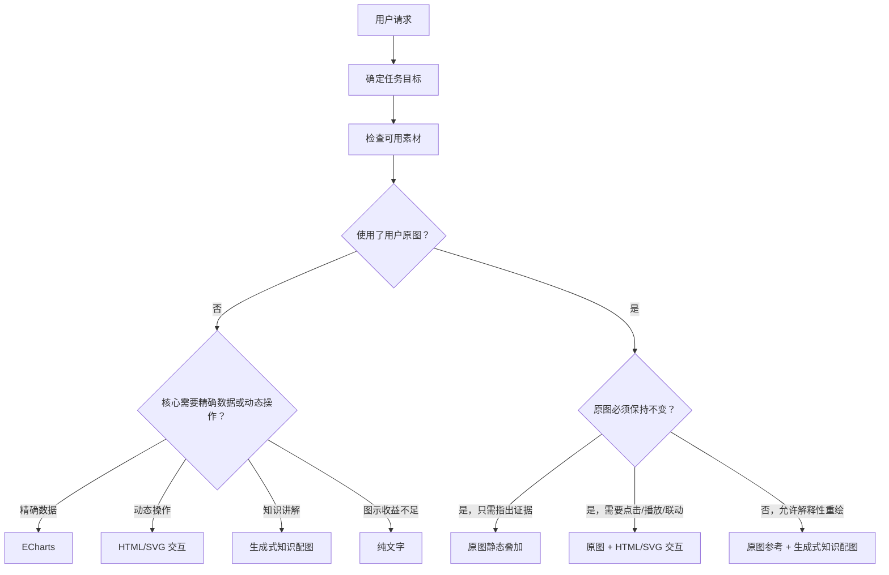

# 组合式路由

## 目录

- [一、判断可视化收益](#一判断可视化收益)
- [二、确定任务目标](#二确定任务目标)
- [三、确定素材策略](#三确定素材策略)
- [四、选择呈现方式](#四选择呈现方式)
- [五、组合决策](#五组合决策)
- [六、常见冲突](#六常见冲突)

## 总览图

## 一、判断可视化收益

以下任一条件成立即可进入规划：

- 用户明确说可视化、画图、图解、配图、标注、圈出、连线、趋势图、动态图、动画、交互、直观展示。
- 内容包含趋势、占比、排行、分布、相关性或多指标对比。
- 答案依赖图片中的对象、位置、区域、数量、路径、轨迹、对应或差异。
- 参数变化、算法步骤、状态迁移、物理过程或几何约束需要观察过程。
- 概念、机制、流程、历史、人物关系、作品结构或知识对比用图能显著降低理解成本。

以下情况不强行可视化：普通改写、翻译、简短定义、代码调试、闲聊、安全拒答、纯文字已足够清楚，或用户明确不要图。

## 二、确定任务目标

允许一个主目标和一个辅助目标：

- `data_analysis`：准确呈现数值、统计关系和可复核趋势。
- `knowledge_explanation`：帮助理解概念、机制、结构、流程和叙事关系。
- `visual_evidence`：展示用户原图中支持结论的真实证据。
- `dynamic_exploration`：通过操作或播放观察因果变化。

主目标决定主要输出，辅助目标只能增加互补模块。不要用多个模式重复同一事实。

## 三、确定素材策略

- `use_structured_data`：使用用户数据或合法核验数据。
- `preserve_user_image`：用户原图是证据或精确底图，像素内容与位置不得改变。
- `reference_user_image`：用户允许解释性重绘，原图只用于外形、结构、材质、风格或构图参考。
- `use_text_context`：基于用户文字、附件内容或当前可靠答案。
- `use_verified_sources`：先用合法搜索或资料工具核验事实。
- `no_source_asset`：不依赖外部素材，自绘抽象结构。

### 用户原图判定

按顺序判断：

1. 结论是否依赖原图的真实位置、数量、文字、边界或细节？是 → `preserve_user_image`。
2. 用户是否要求“在原图上”圈、标、连、点、演示？是 → `preserve_user_image`。
3. 用户是否要求“参考这张图重绘、改成知识图、生成剖面图、换风格”？是 → `reference_user_image`。
4. 用户只上传图片但任务与图片没有必要联系？不要强行使用图片。
5. 意图不清且重绘可能损害事实时，默认保持原图；必要时简短确认是否允许二次生成。

## 四、选择呈现方式

### `echarts`

用于趋势、排行、占比、分布、相关性、层级、流向、漏斗、K 线等精确图表。用户明确要求 ECharts/option 时直接选择。

### `static_image_overlay`

保持用户原图不变，在其上叠加点、框、线、箭头、路径、匹配和标签。只在标注有信息增量时使用。

### `interactive_html`

用于点击、拖动、滑块、播放、切换、逐步展示或联动。可以基于用户原图，也可以基于 SVG/Canvas/HTML 自绘结构或嵌入确定性数据图。

### `generated_illustration`

用于概念、机制、流程、人物关系、历史、作品解读和章节配图。可以从文字直接生成，也可以使用用户原图作为参考，但不能承担精确数据或原图证据。

### `text_only`

可视化收益不足、素材不可用且图示无法可靠生成，或用户明确只要文字时选择。

## 五、组合决策

默认选择一个 presentation。只有满足以下全部条件才增加第二个：

1. 单一模块遗漏用户的独立核心目标；
2. 两个模块表达的信息不同；
3. 第二模块带来的理解收益明显大于额外复杂度；
4. 每个模块的数据、事实和素材条件都满足。

推荐组合：

| 需求 | 组合 |
| --- | --- |
| 点击设备照片查看工作原理 | `preserve_user_image + interactive_html` |
| 把实物照片重绘成剖面知识图 | `reference_user_image + generated_illustration` |
| 在原图指出部件并展示其参数趋势 | `static_image_overlay + echarts` |
| 基于截图逐步讲解状态变化 | `preserve_user_image + interactive_html` |
| 算法动画并比较每步耗时 | `interactive_html + echarts` |
| 历史文章配格局图和时间线插图 | `generated_illustration`；通常不再叠加 ECharts |

组合顺序通常为：文字结论 → 原图证据/交互 → 精确图表 → 解释性配图。只输出实际需要的部分。

## 六、常见冲突

- **数据图 vs 生成配图**：有精确数据时图表优先；生成图只能解释机制或提供氛围，不承载数字。
- **原图标注 vs 二次生成**：证据任务保持原图；只有用户允许且结果不作为证据时才二次生成。
- **ECharts option vs HTML ECharts**：普通数据图只输出原生 option；只有自定义交互必须控制 DOM/多视图时，才在 HTML renderer 中使用图表库。
- **静态标注 vs 交互**：点击、切换和逐步解释有价值时用交互，否则静态标注更稳定。
- **知识配图 vs HTML 图解**：需要可复核结构、精确连线或文字准确时优先 HTML/SVG；允许解释性、编辑感插画时用生成图。
- **地图需求**：所有模式均禁止地图渲染，改为非地图表达。
